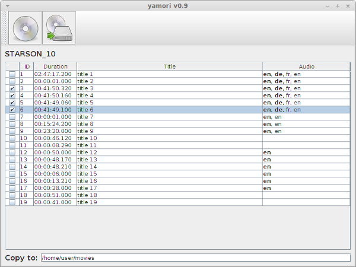

# yamori
**Y**et **A**nother **MO**vie **RI**pper is a utility that allows you to backup your movies (DVDs)
in simple an intuitive way.

It is a graphical frontend for the common unix utilities
* lsdvd
* mplayer
* mkvtoolnix (mkvmerge)

so these have to be installed in order to use *yamori*.

*yamori* is a pure java application, so java (>= 1.8) is required.

## run yamori
To run execute following command:
<pre>java -jar yamori.jar</pre>

## get yamori
Prebuild binaries can be found here:
[https://github.com/mr-mister123/yamori/releases/latest](https://github.com/mr-mister123/yamori/releases/latest)

## screenshot
